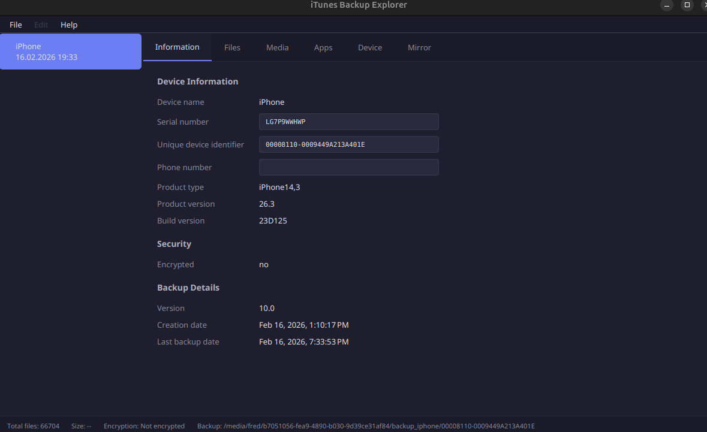
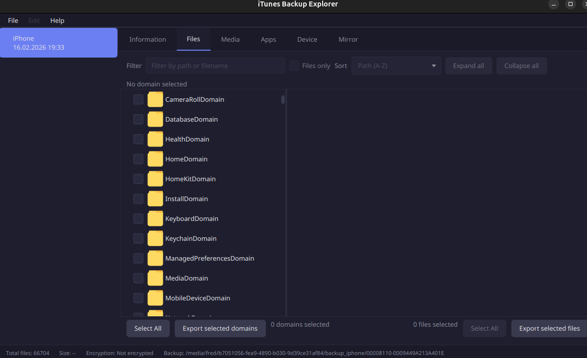
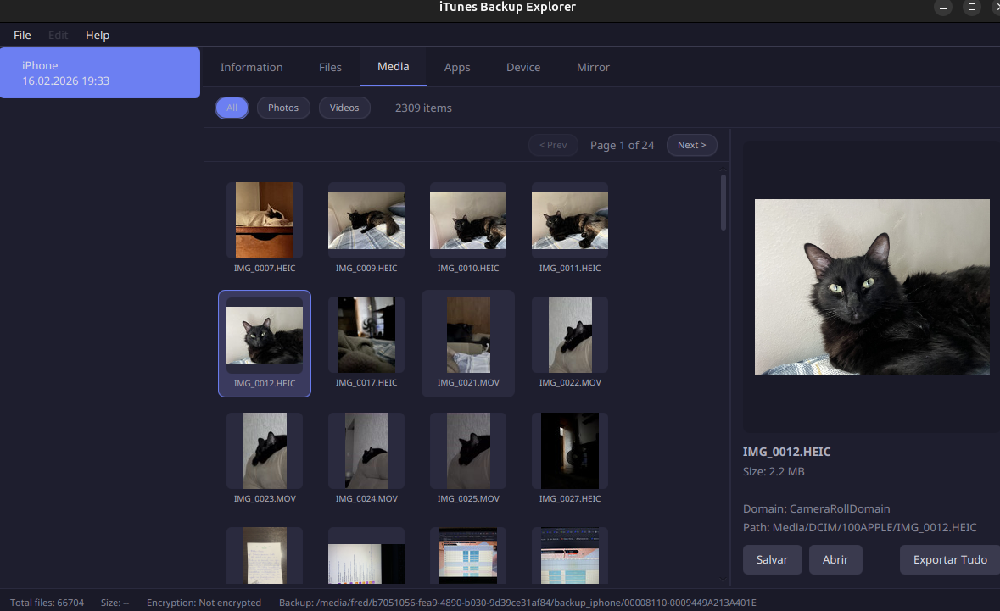
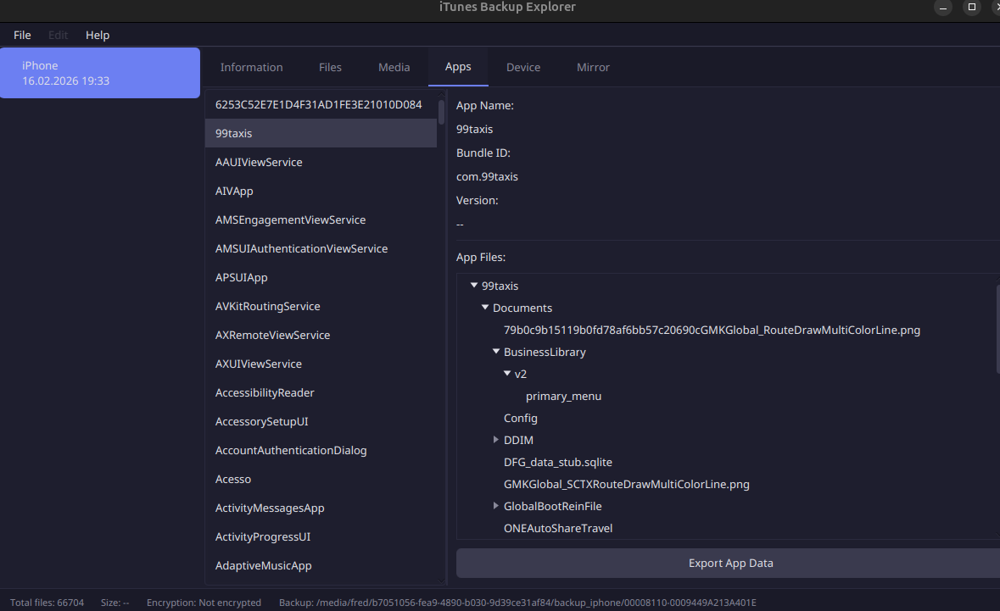
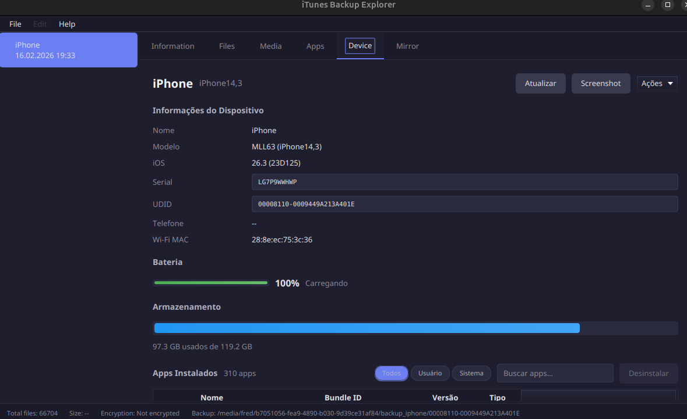
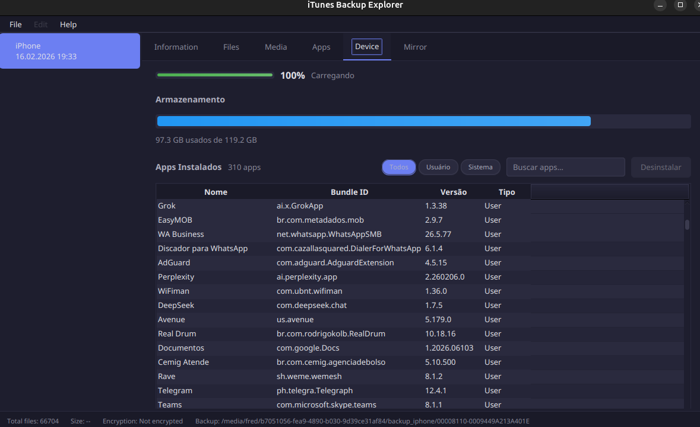

<h1 align="center">iTunes Backup Explorer</h1>

<p align="center">
  <strong>Open-source tool to browse encrypted iTunes backups, mirror your iPhone screen, manage apps, and explore your media — all from your desktop.</strong>
</p>

<p align="center">
  <a href="#screen-mirroring">Screen Mirroring</a> •
  <a href="#media-gallery">Media Gallery</a> •
  <a href="#device-control">Device Control</a> •
  <a href="#backup-explorer">Backup Explorer</a> •
  <a href="#screenshots">Screenshots</a> •
  <a href="#installation">Installation</a>
</p>

<p align="center">
  
  
  
  
  
</p>

---

## What is iTunes Backup Explorer?

iTunes Backup Explorer is a **free, open-source desktop app** that lets you browse and manage iPhone backups on any platform. It also connects to your iPhone for real-time screen mirroring, device management, and full backup creation. No cloud, no subscriptions, no data collection.

### Quick start

```bash
git clone https://github.com/fredac100/iTunes-Backup-Explorer.git
cd iTunes-Backup-Explorer
```

**Windows:**
```
compile.bat
run.bat
```

**Linux/macOS:**
```bash
./compile.sh
./run.sh
```

`compile` builds the fat JAR (required on first run). `run` launches the app.

> Requires **JDK 18+** and **Apache Maven**.

<details>
<summary>Advanced Maven commands</summary>

```bash
# Native executable + installer
mvn clean package

# Fat JAR (cross-platform)
mvn clean compile assembly:single

# Multi-platform JAR (Windows + Linux + ARM macOS)
mvn clean compile assembly:single -Pmost_platforms

# Run directly (development)
mvn exec:exec
```
</details>

| What you get | How it works |
|---|---|
| **USB screen mirroring** | See your iPhone screen in real time via USB with interactive touch |
| **Full media gallery** | Browse your photos and videos with real thumbnails, not just file names |
| **Live device control** | Battery, storage, apps, screenshots, power controls — all via USB |
| **Backup creation** | Create full iPhone backups with progress, speed, and ETA |
| **Encrypted backup support** | AES-256 decryption with Apple's KeyBag system |
| **Offline by design** | Zero network access — your data stays on your machine |

---

## Key Features

### Screen Mirroring

| Feature | Description |
|---------|-------------|
| **USB mirroring** | Real-time screen capture via direct USB connection using pymobiledevice3 |
| **Parallel capture** | Up to 4 simultaneous USB connections for higher frame rates |
| **Interactive touch** | Tap and swipe gestures forwarded to the device via WDA |
| **iOS 17+ support** | Automatic tunnel setup via `tunneld` with admin elevation |
| **View-only mode** | Watch without sending touch events (when WDA is unavailable) |
| **AirPlay wireless** | Stream via AirPlay using uxplay (Linux only — temporarily disabled on Windows) |

### Media Gallery

| Feature | Description |
|---------|-------------|
| **Visual grid** | Real 90x90px thumbnail previews with async 4-thread loading and in-memory cache |
| **Filters** | Toggle between All / Photos / Videos |
| **Pagination** | Smooth browsing with 100 items per page |
| **Preview panel** | Full-size preview with filename, size, domain and path |
| **Bulk export** | Export individual files or the entire gallery with directory structure and timestamps |
| **Format support** | JPG, PNG, HEIC, HEIF, GIF, BMP, TIFF, MOV, MP4, M4V, AVI |
| **Auto-setup** | On Windows, ffmpeg and ImageMagick are downloaded automatically for video/HEIC thumbnails |

### Device Control

| Feature | Description |
|---------|-------------|
| **Device info** | Model, iOS version, serial, UDID, Wi-Fi MAC, battery, storage |
| **Installed apps** | Full list with filters (All / User / System), search, and uninstall |
| **Screenshots** | Capture your device screen directly from the app |
| **Power controls** | Restart, shutdown, or sleep your device remotely |
| **Storage monitor** | Visual progress bar with used/total breakdown |
| **Dual backend** | Works via libimobiledevice (primary) or pymobiledevice3 (automatic fallback) |

### Backup Creation

| Feature | Description |
|---------|-------------|
| **Full backup** | Create complete iPhone backups via USB |
| **Progress tracking** | Real-time progress bar, transfer speed (MB/s), ETA, bytes transferred |
| **Two backends** | Uses `idevicebackup2` or `pymobiledevice3 backup2` (automatic fallback) |
| **Cancellable** | Cancel at any time with full process cleanup |
| **Auto-register** | Backup destination is automatically added to the sidebar after success |

### Backup Explorer

| Feature | Description |
|---------|-------------|
| **Auto-discovery** | Automatically finds backups from default iTunes/Finder directories |
| **Encrypted backups** | Full AES-256 CBC decryption using Apple's KeyBag and protection class model |
| **Hierarchical browser** | Tree view organized by domain and path with context menu actions |
| **File search** | Full-text search with quick filters: Photos, Videos, WhatsApp, Contacts, Messages, Notes, Voice Memos |
| **File modification** | Replace files (re-encrypted automatically), delete entries, with incremental safety backups |
| **Drag & drop** | Load backup folders by dropping them into the app |
| **Multiple backups** | Open and switch between several backups simultaneously via sidebar |

### Apps Browser

| Feature | Description |
|---------|-------------|
| **App list** | All apps from the backup with name, bundle ID, and version |
| **File tree** | Expandable directory tree for each app's data |
| **Export** | Export individual app data with progress tracking |

### Security & Privacy

- Decrypted database temp files are **securely zeroed out** and deleted on exit
- All backup modifications create **incremental safety backups** before any change
- **Path traversal protection** on file extraction
- **char[] for passwords** with cleanup after use (not String)
- **No internet connection** — the app is fully offline by design
- **No data collection** — zero telemetry, zero analytics

---

## Screenshots

### Backup Information


### Backup Browser


### Media Gallery


### Apps


### Device Info & Controls




### Screen Mirroring


---

## Installation

### Optional Dependencies

These tools are only needed for specific features. **On Windows, the app downloads them automatically** when needed.

| Dependency | Purpose | Linux | Windows |
|------------|---------|-------|---------|
| [libimobiledevice](https://github.com/libimobiledevice/libimobiledevice) | Device tab, USB backup | `sudo apt install libimobiledevice-utils` | Included in Apple Devices / iTunes |
| [pymobiledevice3](https://github.com/doronz88/pymobiledevice3) | Mirror tab, device fallback, backup fallback | `pip install pymobiledevice3` | **Automatic** (downloads portable Python 3.12.8 if needed) |
| [ffmpeg](https://ffmpeg.org/) | Video thumbnails in Media tab | `sudo apt install ffmpeg` | **Automatic** (downloaded on first need, ~85 MB) |
| [ImageMagick](https://imagemagick.org/) | HEIC/HEIF thumbnails in Media tab | `sudo apt install imagemagick libheif1` | **Automatic** (downloaded on first need, ~50 MB) |
| [uxplay](https://github.com/antimof/UxPlay) | AirPlay wireless mirroring | `sudo apt install uxplay` | Not available (temporarily disabled) |

The app works fully for backup browsing, media gallery, and file management without these dependencies.

> **Note on Windows auto-setup:** When a tool is missing, the app offers to download and set it up automatically. Portable tools are stored in `~/.config/itunes-backup-explorer/` and don't require admin privileges or system-wide installation.

---

## Tech Stack

| Component | Technology |
|-----------|-----------|
| Language | Java 18+ |
| GUI Framework | JavaFX 23 (FXML MVC) |
| Build System | Apache Maven |
| Cryptography | Bouncy Castle 1.80 (AES-256, PBKDF2, AES-Wrap) |
| Database | SQLite (Xerial sqlite-jdbc 3.49) |
| Plist Parsing | dd-plist |
| Compression | Apache Commons Compress + XZ |
| Screen Mirroring | pymobiledevice3 (Python, USB + AirPlay) |
| Device Communication | libimobiledevice (CLI) + pymobiledevice3 (fallback) |
| Video Thumbnails | ffmpeg |
| HEIC Thumbnails | ImageMagick (primary) / ffmpeg (fallback) |
| Tests | JUnit Jupiter 5 |

---

## File Search Syntax

The search tab uses case-insensitive SQLite LIKE syntax with two wildcards:

- `%` — matches any sequence of zero or more characters
- `_` — matches any single character
- `\` — escape character

**Quick filters** are available for common searches: Photos, Videos, WhatsApp, Contacts, Messages, Notes, Voice Memos.

**Examples:**

| Goal | Domain | Relative Path |
|------|--------|---------------|
| Camera roll videos | `CameraRollDomain` | `%.mov` |
| Files under DCIM | `CameraRollDomain` | `Media/DCIM/%` |
| All SQLite databases | `%` | `%.sqlite` |
| WhatsApp files | `%whatsapp%` | `%` |
| iCloud app documents | `HomeDomain` | `Library/Mobile Documents/iCloud~%` |
| All files | `%` | `%` |

---

## Privacy

This application does **not** collect any data. It does not use an internet connection at any point. All processing happens entirely on your local machine.

---

## Origin

iTunes Backup Explorer is a fork of the [original iTunes Backup Explorer](https://github.com/MaxiHuHe04/iTunes-Backup-Explorer) by [MaxiHuHe04](https://github.com/MaxiHuHe04), which provided the foundation for encrypted backup browsing. This project extends it with screen mirroring, media gallery, live device control, backup creation, automatic tool setup, and a modern UI.

**Key references:**
- [iPhone Data Protection in Depth](https://conference.hitb.org/hitbsecconf2011ams/materials/D2T2) (HITB SecConf 2011)
- [iphone-dataprotection](https://code.google.com/archive/p/iphone-dataprotection/) project
- [Forensic Analysis of iTunes Backups](http://www.farleyforensics.com/2019/04/14/forensic-analysis-of-itunes-backups/) by Jack Farley
- Apple iOS Security Guide

---

## License

MIT — use it, fork it, build on it.
